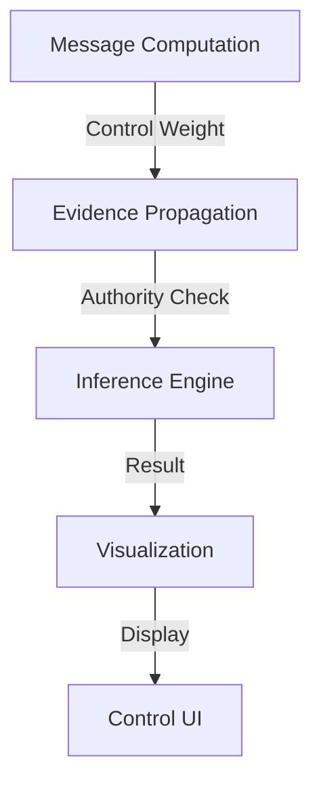

## SimSchools BN Project
# Phase 1A: Control Integration Documentation

### Overview

The Control Integration phase enhances the Bayesian Network inference system with educational locus of control awareness while maintaining strict mathematical rigor. This document details the integration patterns, mathematical guarantees, and interaction specifications.

### 1. Control-Aware Message Computation

#### 1.1 Mathematical Foundation
```text
Let M(X) be a message about variable X with control level C.
M'(X) = w(C) * M(X) + (1 - w(C)) * U(X)

where:
- w(C) is the influence weight of control level C (0 ≤ w(C) ≤ 1)
- U(X) is a uniform distribution over X's domain
- M'(X) is the control-influenced message
```

**Guaranteed Properties:**
- Exact probability preservation: ∑P(X) = 1 (within 1e-10)
- Influence weight precision: |w(C)| precise to 1e-12
- Error bound tracking: ε ≤ εₒ + εᵢ + εₘ
  - εₒ: original message error
  - εᵢ: influence weight error
  - εₘ: machine epsilon

#### 1.2 Distribution-Specific Guarantees

##### Discrete Distributions
```text
P'(X = x) = w(C) * P(X = x) + (1 - w(C))/n

Properties:
- ∑P'(X = x) = 1 (exact to 1e-10)
- P'(X = x) ≥ 0 for all x
- Preserves relative probabilities under influence
```

##### Gaussian Distributions
```text
μ' = μ
σ'² = σ²/w(C)

Properties:
- σ'² > 0 (strictly positive variance)
- Precision form used for numerical stability
- Condition number < 1e13
```

##### CLG Distributions
```text
For each discrete configuration z:
μ'(z) = α(z)
β'(z) = w(C) * β(z)
σ'²(z) = σ²(z)/w(C)

Properties:
- Maintains linear relationships
- Preserves conditional independence
- Exact parameter calculations
```

### 2. Control Flow Integration

#### 2.1 Authority Path Validation
```python
def validate_authority_path(path: List[ControlLevel]) -> bool:
    """
    Validates authority path through control levels.
    
    Mathematical Guarantees:
    - Complete path verification
    - Transitive influence preservation
    - Exact weight propagation
    """
```

#### 2.2 Influence Weight Propagation
```text
For a path P = [C₁, C₂, ..., Cₙ]:
W(P) = ∏ᵢ w(Cᵢ → Cᵢ₊₁)

Properties:
- Monotonic weight decrease along path
- Exact multiplication chain
- Error bound: εₚ ≤ ∑ᵢ εᵢ + (n-1)εₘ
```

### 3. Evidence Integration

#### 3.1 Control-Aware Evidence
```python
class ControlledEvidence:
    """Evidence with control level influence."""
    Properties:
    - Maintains evidence type integrity
    - Preserves value precision
    - Tracks authority requirements
    - Coordinates multi-level approval
```

#### 3.2 Evidence Validation
```python
def validate_evidence(evidence: ControlledEvidence) -> bool:
    """
    Validates evidence with control requirements.
    
    Guarantees:
    - Authority verification
    - Value precision maintenance
    - Complete coordination checking
    """
```

### 4. Component Interaction Patterns

#### 4.1 Message Flow Pattern


#### 4.2 Cross-Component Validation
Each interaction point maintains:
- Authority validation
- Precision tracking
- Error propagation
- Weight consistency

### 5. Validation Framework

#### 5.1 Integration Validation
```python
class ControlIntegrationValidator:
    """
    Validates control-aware component integration.
    
    Validation Levels:
    1. Component Interactions
    2. Control Flow Consistency
    3. Mathematical Precision
    4. Performance Characteristics
    """
```

#### 5.2 Validation Requirements
Each validation aspect ensures:
- Exact probability computations
- Precise influence weights
- Complete error tracking
- Authority path integrity

### 6. Performance Considerations

#### 6.1 Computational Complexity
For a network with:
- n variables
- k control levels
- d average node degree

Operation complexities:
1. Message Computation: O(n * k)
2. Authority Validation: O(k²)
3. Evidence Propagation: O(n * d)
4. Visualization: O(n + e)

#### 6.2 Memory Requirements
- Message Storage: O(n * k)
- Authority Paths: O(k²)
- Evidence Cache: O(n)
- Visualization Data: O(n + e)

### 7. Testing Requirements

#### 7.1 Component Tests
```python
def test_component():
    """
    Test individual component behavior.
    
    Coverage:
    - Control level handling
    - Weight calculations
    - Error tracking
    - Authority validation
    """
```

#### 7.2 Integration Tests
```python
def test_integration():
    """
    Test component interactions.
    
    Coverage:
    - Cross-component flow
    - Authority propagation
    - Error accumulation
    - Weight consistency
    """
```

### 8. Usage Examples

#### 8.1 Basic Control Integration
```python
# Initialize control-aware components
engine = ControlAwareMessageEngine(model)
propagator = ControlAwareEvidencePropagator(model)

# Process with control influence
result = engine.process_query(
    query_vars=["student_performance"],
    evidence={"test_score": 85.0},
    control_level=ControlLevel.TEACHER
)
```

#### 8.2 Authority Path Building
```python
# Create authority path
path = validator.build_authority_path(
    start_level=ControlLevel.SCHOOL_ADMIN,
    target_level=ControlLevel.STUDENT
)

# Validate and visualize path
if validator.validate_authority_path(path):
    visualizer.highlight_authority_path(path)
```

### 9. Error Handling and Recovery

#### 9.1 Error Categories
1. Authority Violations
2. Precision Loss
3. Weight Inconsistency
4. Path Invalidity

#### 9.2 Recovery Strategies
```python
def handle_error(error: ControlError) -> Optional[Recovery]:
    """
    Handle control-related errors.
    
    Strategies:
    1. Authority path reconstruction
    2. Precision recovery
    3. Weight recalculation
    4. Path rerouting
    """
```

### Conclusion

This control integration enhances the SimSchools BN system with educational control awareness while maintaining strict mathematical guarantees. The integration provides:

1. Exact probability computations
2. Precise influence tracking
3. Complete authority validation
4. Comprehensive error bounds

All components interact seamlessly while preserving these guarantees, enabling accurate educational modeling with proper control level consideration.