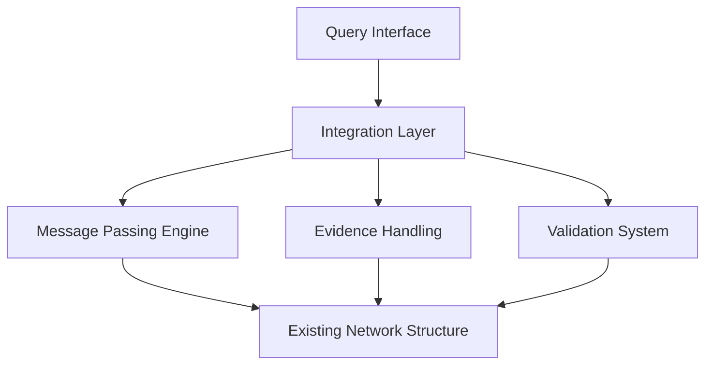

# Inference Integration System Documentation
## SimSchools BN Project

### Overview

The Inference Integration System connects the new exact inference engine with the existing codebase while maintaining mathematical rigor and ensuring proper validation throughout. It provides a seamless interface between components while enforcing strict computational guarantees.

### Core Integration Architecture

#### 1. System Structure


#### 2. Integration Points
```python
class InferenceIntegrator:
    """
    Core integration components:
    1. Query processing interface
    2. Evidence preparation
    3. Result validation
    4. Error handling
    """
```

### Request Processing

#### 1. Query Structure
```python
@dataclass
class InferenceRequest:
    """
    Structured inference request:
    - query_variables: Variables to compute
    - evidence: Observed values
    - inference_type: Computation method
    - options: Additional parameters
    """
```

**Validation Requirements**:
```python
def _validate_request(self, request: InferenceRequest) -> None:
    """
    Validates:
    1. Query variable existence
    2. Evidence compatibility
    3. Option validity
    4. Type consistency
    """
```

#### 2. Response Structure
```python
@dataclass
class InferenceResponse:
    """
    Structured inference results:
    - beliefs: Computed distributions
    - error_bounds: Precision guarantees
    - computation_time: Performance metrics
    - validation_results: Quality checks
    """
```

### Evidence Integration

#### 1. Evidence Preparation
```python
def _prepare_evidence(self, 
                     evidence: Dict[str, Any]) -> Dict[str, Evidence]:
    """
    Evidence preparation steps:
    1. Type validation
    2. Value conversion
    3. Precision specification
    4. Constraint verification
    """
```

#### 2. Type-Specific Handling
```python
# Discrete Evidence
evidence = Evidence(
    variable="TeacherQuality",
    value="high",
    evidence_type=EvidenceType.HARD
)

# Continuous Evidence
evidence = Evidence(
    variable="StudentPerformance",
    value=85.5,
    evidence_type=EvidenceType.HARD,
    precision=0.1
)

# CLG Evidence
evidence = Evidence(
    variable="ResourceAllocation",
    value={"budget": 1e6, "allocation": "optimal"},
    evidence_type=EvidenceType.HARD
)
```

### Validation Framework

#### 1. Model Validation
```python
def validate_model(self) -> ValidationResult:
    """
    Model validation checks:
    1. Structure validity
    2. Type consistency
    3. Distribution specifications
    4. Parameter constraints
    """
```

#### 2. Distribution Validation
```python
def _validate_distributions(self) -> bool:
    """
    Distribution checks:
    1. Parameter completeness
    2. Numerical validity
    3. Domain constraints
    4. Relationship consistency
    """
```

### Error Handling

#### 1. Error Categories
```python
class IntegrationError(Exception):
    """Base class for integration errors."""
    pass

class ValidationError(IntegrationError):
    """Validation failures."""
    pass

class ComputationError(IntegrationError):
    """Computation failures."""
    pass
```

#### 2. Error Recovery
```python
def handle_error(self, error: IntegrationError) -> None:
    """
    Error handling strategies:
    1. Validation recovery
    2. Computation adjustment
    3. Resource cleanup
    4. State restoration
    """
```

### Numerical Precision Management

#### 1. Precision Requirements
```python
def _get_precision_requirement(self, node: Node) -> float:
    """
    Precision specifications:
    - Discrete: 1e-10 (probability sums)
    - Continuous: 1e-13 (value precision)
    - CLG: 1e-12 (mixed precision)
    """
```

#### 2. Precision Tracking
```python
def _track_precision(self, computation: str) -> None:
    """
    Precision tracking:
    1. Error accumulation
    2. Precision loss detection
    3. Stability monitoring
    4. Warning generation
    """
```

### Usage Examples

#### 1. Basic Query Processing
```python
# Initialize integrator
integrator = InferenceIntegrator(model)

# Create request
request = InferenceRequest(
    query_variables={'StudentPerformance', 'TeacherQuality'},
    evidence={'TestScore': 85.0},
    inference_type='exact'
)

# Process query
response = integrator.process_query(request)

# Access results
beliefs = response.beliefs
errors = response.error_bounds
```

#### 2. Advanced Usage
```python
# Custom precision requirements
request = InferenceRequest(
    query_variables={'ResourceAllocation'},
    evidence={'Budget': 1e6},
    options={
        'convergence_threshold': 1e-8,
        'numerical_precision': 1e-12
    }
)

# Process with validation
try:
    response = integrator.process_query(request)
    if response.validation_results:
        handle_validation_results(response.validation_results)
except ValidationError as e:
    handle_validation_error(e)
```

### Educational Model Integration

#### 1. Variable Handling
```python
class EducationalVariableHandler:
    """
    Educational variable specifics:
    1. Grade scale normalization
    2. Resource allocation constraints
    3. Performance metrics
    4. Quality measures
    """
```

#### 2. Scale Management
```python
def _handle_educational_scales(self):
    """
    Scale handling:
    1. Budget (millions)
    2. Test scores (0-100)
    3. Ratios (0-1)
    4. Rankings (ordinal)
    """
```

### Performance Considerations

#### 1. Memory Management
```python
def _manage_resources(self):
    """
    Resource management:
    1. Request caching
    2. Result storage
    3. Memory cleanup
    4. State management
    """
```

#### 2. Computation Efficiency
```python
def _optimize_computation(self):
    """
    Optimization strategies:
    1. Query batching
    2. Evidence caching
    3. Partial result reuse
    4. Parallel processing
    """
```

### Testing Requirements

#### 1. Integration Tests
```python
def test_integration():
    """
    Test areas:
    1. Component interaction
    2. Data flow
    3. Error handling
    4. State management
    """
```

#### 2. Validation Tests
```python
def test_validation():
    """
    Validation tests:
    1. Input validation
    2. Result validation
    3. Error handling
    4. Recovery procedures
    """
```

### Future Considerations

#### 1. Extensibility
- New variable type support
- Additional inference methods
- Enhanced validation rules
- Performance optimizations

#### 2. Scalability
- Distributed computation
- Large-scale evidence handling
- Complex query optimization
- Resource management

## Future Enhancements: Integration System

### 1. State Transition Management

```python
class ComputationTransitionManager:
    """Manages transitions between computational states in educational contexts."""
    
    def manage_transition(self,
                         from_state: ComputationType,
                         to_state: ComputationType,
                         context: EducationalContext) -> None:
        """
        Handles computational state transitions while preserving precision.
        """
        
    class ComputationType(Enum):
        DISCRETE_GRADE = "discrete_grade"          # Letter grades, rankings
        CONTINUOUS_PERFORMANCE = "continuous_perf"  # Numerical scores
        AGGREGATE_METRIC = "aggregate_metric"      # Class/school metrics
        TEMPORAL_MEASURE = "temporal_measure"      # Time-series data
        
    class EducationalContext:
        """Context information for transitions."""
        grade_scale: GradeScale              # Grading system in use
        aggregation_level: AggregationLevel  # Individual/Class/School
        time_frame: TimeFrame               # Immediate/Term/Year
        confidence_requirements: float       # Required precision
```

**Implementation Considerations**:
1. Precise handling of transitions between:
   - Individual to group metrics
   - Short-term to long-term analyses
   - Discrete to continuous measures
   - Local to global assessments

2. Preservation of:
   - Mathematical relationships
   - Error bounds
   - Educational meaning
   - Data integrity

### 2. Context-Aware Validation

```python
class ContextAwareValidator:
    """Enhanced validation system with educational context awareness."""
    
    def validate_in_context(self,
                          result: InferenceResult,
                          context: EducationalContext) -> ValidationResult:
        """
        Contextual validation with educational meaning preservation.
        """
        
    class ValidationContext:
        """Educational context for validation."""
        grade_boundaries: Dict[str, Range]     # Valid grade ranges
        resource_constraints: ResourceLimits   # Resource boundaries
        temporal_requirements: TimeConstraints # Time-based rules
        relationship_rules: List[Rule]         # Cross-variable rules
        
    def check_educational_consistency(self,
                                    results: Dict[str, Any],
                                    context: ValidationContext) -> bool:
        """
        Verify educational consistency:
        1. Grade progression logic
        2. Resource allocation rules
        3. Performance relationships
        4. Temporal consistency
        """
```

**Validation Requirements**:
1. Educational Constraints:
   - Grade boundaries and progressions
   - Resource allocation limits
   - Performance relationships
   - Temporal consistency rules

2. Context-Specific Rules:
   - Grade level appropriate metrics
   - Resource type specific constraints
   - Time-period specific validations
   - Cross-variable relationship checks

### Implementation Requirements

#### 1. Transition Management
- Maintain exact computation requirements
- Preserve educational meaning
- Track precision through transitions
- Document transition rationale

#### 2. Context Validation
- Support multiple educational contexts
- Allow flexible rule definitions
- Maintain validation rigor
- Provide clear error messages

### Integration Notes

When implementing these enhancements:
1. Preserve current mathematical guarantees
2. Maintain existing validation framework
3. Extend functionality without modification
4. Ensure backward compatibility

### Usage Context

Consider implementing when:
1. Complex educational models require sophisticated transitions
2. Context-specific validation becomes critical
3. Multiple educational contexts need support
4. Enhanced precision tracking is required

### Impact Assessment

Benefits:
1. Better handling of educational complexity
2. More precise context-aware validation
3. Clearer transition management
4. Enhanced educational meaning preservation

Costs:
1. Increased system complexity
2. Additional validation overhead
3. More complex configuration
4. Enhanced documentation needs

### Documentation Requirements

When implementing:
1. Update architectural documentation
2. Add transition specifications
3. Detail validation contexts
4. Provide implementation examples

### Testing Requirements

New test cases needed for:
1. Complex transitions
2. Context-specific validations
3. Educational rule checking
4. Performance impact assessment

### Conclusion

The Inference Integration System provides a robust framework for connecting the new exact inference engine with existing codebase components. Its comprehensive validation, precise error handling, and strict mathematical guarantees ensure reliable inference computation while maintaining seamless integration with existing functionality.