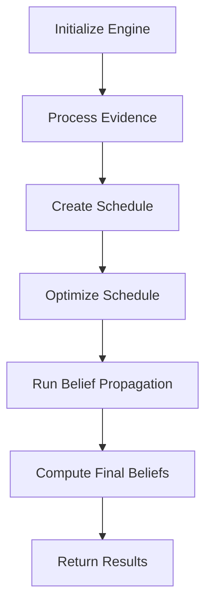
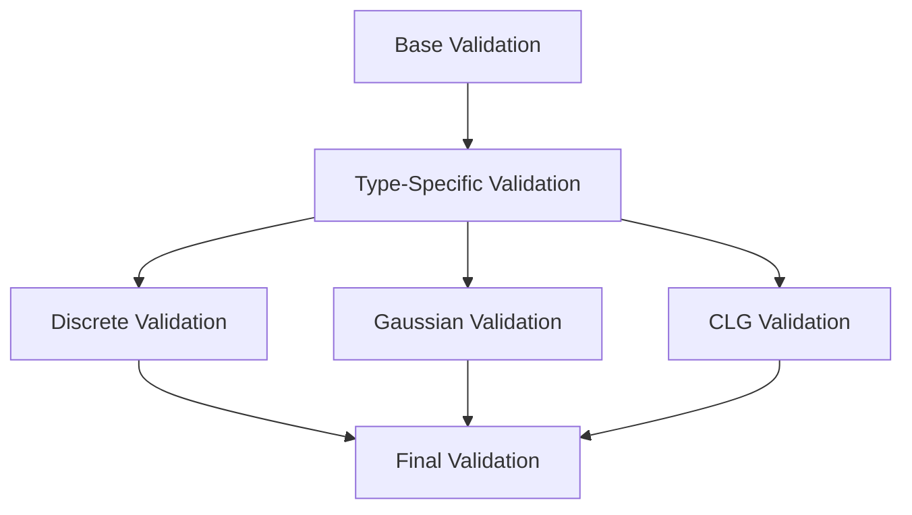

## SimSchools BN Project
# Message Passing Engine Documentation

### Overview

The Message Passing Engine represents the core inference system, integrating scheduling, computation, and evidence handling components while maintaining mathematical rigor. It orchestrates belief propagation in mixed Bayesian networks with strict guarantees on numerical precision and stability.

### Core Components Integration

#### 1. Component Integration
```python
class MessagePassingEngine:
    def __init__(self, model: BayesianNetwork):
        self.computation_engine = MessageComputationEngine(model)
        self.scheduler = MessageScheduler(model)
        self.evidence_propagator = EvidencePropagator(model)
```

**Integration Guarantees**:
- Consistent validation across components
- Unified error handling
- Synchronized state management
- Coherent numerical precision

#### 2. Inference Flow


### Inference Process

#### 1. Initialization
```python
def run_inference(self,
                 query_variables: Set[str],
                 evidence: Optional[Dict[str, Evidence]] = None,
                 **kwargs) -> InferenceResult:
    """
    Main inference entry point:
    1. Initialize state
    2. Create message schedule
    3. Run belief propagation
    4. Compute final beliefs
    """
```

**Initialization Requirements**:
- Clean state for new inference
- Evidence incorporation
- Parameter validation
- Resource allocation

#### 2. Message Processing
```python
def _process_message(self, entry: ScheduleEntry) -> None:
    """
    Process individual messages:
    1. Compute new message
    2. Validate result
    3. Update message state
    4. Track numerical properties
    """
```

### Numerical Guarantees

#### 1. Precision Management
```python
class InferenceResult:
    beliefs: Dict[str, Any]          # Computed beliefs
    error_bounds: Dict[str, float]   # Error bounds per variable
    numerical_issues: List[str]      # Numerical stability warnings
    convergence_info: Dict[str, Any] # Convergence diagnostics
```

**Precision Requirements**:
1. Discrete Messages:
   ```python
   abs(sum(probabilities) - 1.0) < 1e-10  # Probability sum
   min(probabilities) >= 0                # Non-negativity
   ```

2. Gaussian Messages:
   ```python
   variance > 1e-13                      # Minimum variance
   abs(mean) < 1e8                       # Maximum mean
   ```

3. CLG Messages:
   ```python
   all(variance > 0 for variance in variances)  # Valid variances
   max(abs(coefficients)) < 1e8                # Coefficient bounds
   ```

#### 2. Convergence Criteria
```python
def _check_convergence(self, old_messages) -> bool:
    """
    Convergence requires:
    1. Maximum message difference < threshold
    2. Valid messages throughout
    3. Stable numerical properties
    """
```

### Validation Framework

#### 1. Message Validation
```python
def _validate_message(self, message: Message) -> bool:
    """
    Validation checks:
    1. Distribution properties
    2. Numerical stability
    3. Domain constraints
    """
```

**Validation Hierarchy**:


#### 2. Belief Validation
```python
def _validate_belief(self, belief: Distribution) -> bool:
    """
    Belief requirements:
    1. Proper normalization
    2. Valid parameters
    3. Error bounds within limits
    """
```

### Error Handling

#### 1. Error Categories
```python
class NumericalError(Exception):
    """Base class for numerical errors."""
    pass

class ConvergenceError(Exception):
    """For convergence failures."""
    pass

class ValidationError(Exception):
    """For validation failures."""
    pass
```

#### 2. Error Recovery
```python
def _handle_numerical_error(self, error: NumericalError) -> None:
    """
    Recovery strategies:
    1. Message recomputation
    2. Precision adjustment
    3. Schedule modification
    """
```

### Educational Model Considerations

#### 1. Variable Types
```python
# Student Performance (continuous)
def _handle_performance_variable(self, var: str) -> None:
    """
    Special handling:
    1. Grade scale normalization
    2. Precision requirements
    3. Bounds checking
    """

# Teacher Quality (discrete)
def _handle_quality_variable(self, var: str) -> None:
    """
    Special handling:
    1. State validation
    2. Transition constraints
    3. Evidence weighting
    """
```

#### 2. Scale Management
```python
def _manage_scales(self, messages: Dict[str, Message]) -> None:
    """
    Handle educational scales:
    1. Budget (millions)
    2. Test scores (0-100)
    3. Ratios (0-1)
    """
```

### Performance Optimization

#### 1. Memory Management
```python
def _optimize_memory(self) -> None:
    """
    Memory strategies:
    1. Message cleanup
    2. Computation reuse
    3. State minimization
    """
```

#### 2. Computation Optimization
```python
def _optimize_computation(self) -> None:
    """
    Optimization strategies:
    1. Message caching
    2. Parallel processing
    3. Early convergence detection
    """
```

### Usage Examples

#### 1. Basic Inference
```python
# Initialize engine
engine = MessagePassingEngine(model)

# Run inference
result = engine.run_inference(
    query_variables={'StudentPerformance', 'TeacherQuality'},
    evidence={'TestScore': Evidence(value=85, type=EvidenceType.HARD)}
)

# Access results
beliefs = result.beliefs
errors = result.error_bounds
```

#### 2. Advanced Usage
```python
# Custom convergence criteria
result = engine.run_inference(
    query_variables={'ResourceAllocation'},
    evidence={'Budget': Evidence(value=1e6, type=EvidenceType.HARD)},
    convergence_threshold=1e-8,
    max_iterations=200
)

# Check convergence
if result.convergence_info['converged']:
    process_beliefs(result.beliefs)
else:
    handle_non_convergence(result.convergence_info)
```

### Testing Requirements

#### 1. Functional Tests
```python
def test_inference_correctness():
    """
    Test:
    1. Belief computation
    2. Evidence incorporation
    3. Convergence properties
    """

def test_numerical_stability():
    """
    Test:
    1. Precision maintenance
    2. Error propagation
    3. Stability conditions
    """
```

#### 2. Integration Tests
```python
def test_component_integration():
    """
    Test:
    1. Component interaction
    2. State consistency
    3. Error handling
    """
```

### Performance Characteristics

#### 1. Time Complexity
- Message Computation: O(d^k) for discrete variables
- Belief Update: O(n) per iteration
- Convergence Check: O(m) for m messages

#### 2. Memory Requirements
- Message Storage: O(e) for e edges
- Belief Storage: O(n) for n nodes
- Computation State: O(d) for max domain size d

### Future Extensions

#### 1. Advanced Features
- Dynamic schedule adjustment
- Adaptive precision control
- Parallel message computation

#### 2. Optimization Opportunities
- GPU acceleration
- Distributed computation
- Cached computation reuse

## Future Enhancements: Message Passing Engine

### 1. Error Propagation Chain Analysis

```python
class ErrorPropagationTracker:
    """Enhanced error tracking system for message chains."""
    
    def track_error_chain(self, 
                         message_sequence: List[ScheduleEntry]) -> Dict[str, ErrorMetrics]:
        """
        Detailed error tracking through message chains.
        
        Tracks:
        1. Transition points between variable types
        2. Error accumulation in mixed chains
        3. Scale-based error impacts
        """
        
    def analyze_critical_paths(self) -> List[ErrorPath]:
        """
        Identifies paths with potential error accumulation:
        1. Long chains of mixed messages
        2. Multiple scale transitions
        3. Precision-critical educational variables
        """
        
    class ErrorMetrics:
        """Detailed error metrics for chain analysis."""
        absolute_error: float        # Absolute error bound
        relative_error: float        # Relative error percentage
        scale_factors: List[float]   # Scale transitions
        critical_points: List[str]   # Points of potential precision loss
```

**Implementation Considerations**:
- Track error propagation through different variable types
- Monitor scale transitions in educational contexts
- Identify critical paths for precision maintenance
- Provide early warning for potential precision loss

### 2. Educational Dependency Handler

```python
class EducationalDependencyHandler:
    """Specialized handling for educational variable dependencies."""
    
    def handle_dependency_chain(self,
                              start_var: str,
                              chain_type: EducationalChainType) -> None:
        """
        Manage educational variable chains.
        
        Example chains:
        1. Resource Allocation:
           Budget -> Resources -> Teacher Quality -> Performance
        
        2. Student Progress:
           Prior Performance -> Current Performance -> Expected Performance
           
        3. Teacher Impact:
           Teacher Quality -> Class Environment -> Student Engagement
        """
    
    class EducationalChainType(Enum):
        """Types of educational dependency chains."""
        RESOURCE_IMPACT = "resource_impact"
        STUDENT_PROGRESSION = "student_progression"
        TEACHER_INFLUENCE = "teacher_influence"
        ENVIRONMENTAL_EFFECT = "environmental_effect"
    
    def optimize_chain_computation(self,
                                 chain: List[str],
                                 precision_requirements: Dict[str, float]) -> None:
        """
        Optimize computation for specific educational chains:
        1. Maintain precision for critical variables
        2. Handle scale transitions appropriately
        3. Preserve educational meaningful relationships
        """
```

### Implementation Requirements

#### 1. Error Propagation Integration
- Must maintain current mathematical guarantees
- Should enhance, not replace, existing error tracking
- Must provide clear documentation of error bounds
- Should integrate with existing validation framework

#### 2. Educational Chain Management
- Must preserve exact computation where required
- Should handle scale transitions automatically
- Must maintain relationship validity
- Should provide educational context-aware optimization

### Usage Context

These enhancements should be implemented when:
1. Error propagation patterns in actual usage indicate need
2. Educational model complexity requires specialized handling
3. Scale transition issues become significant
4. Precision requirements become more stringent

### Integration Notes

When implementing these enhancements:
1. Maintain existing mathematical rigor
2. Preserve current validation framework
3. Extend rather than modify existing functionality
4. Add clear documentation of enhanced capabilities

### Impact on Existing System

The enhancements would provide:
1. More detailed error tracking
2. Better handling of educational relationships
3. Enhanced precision management
4. Clearer understanding of error propagation

While maintaining:
1. Mathematical correctness
2. Computational efficiency
3. System reliability
4. Current functionality

### Documentation Requirements

When implementing:
1. Update mathematical foundations documentation
2. Add detailed error propagation documentation
3. Include educational model usage guidelines
4. Provide examples of enhanced capabilities

### Conclusion

The Message Passing Engine provides a mathematically rigorous framework for exact inference in mixed Bayesian networks. Its integration of scheduling, computation, and evidence handling ensures reliable results while maintaining numerical stability and precision requirements.

The system's comprehensive validation, error handling, and optimization capabilities make it suitable for complex educational modeling applications while maintaining strict mathematical guarantees.