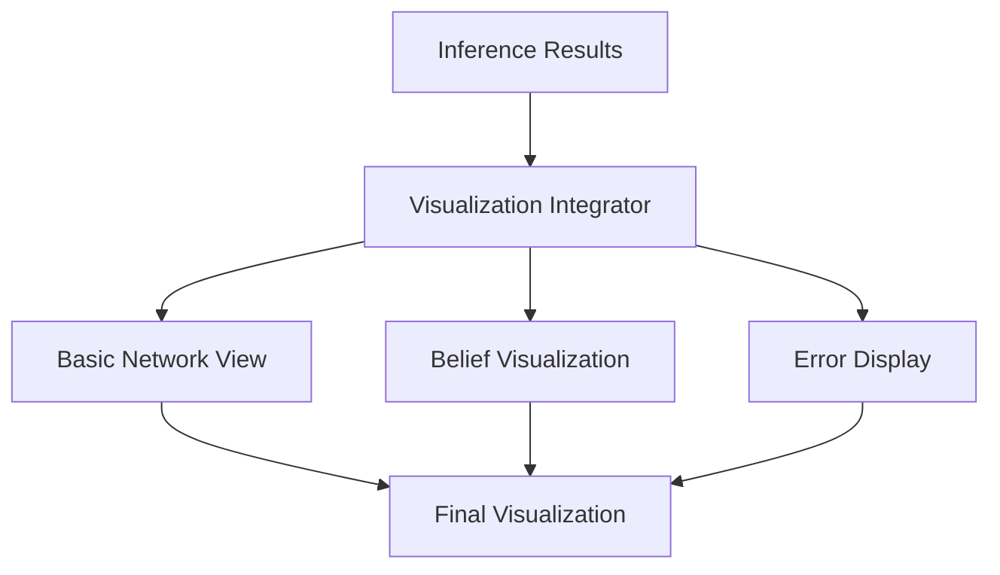

## SimSchools BN Project
# Visualization Integration System Documentation

### Overview

The Visualization Integration System connects the inference engine with the visualization system, ensuring exact representation of computational results while providing education-specific visual insights. The system maintains mathematical rigor while presenting results in an accessible format.

### Core Visualization Architecture

#### 1. System Structure


#### 2. Configuration System
```python
@dataclass
class VisualizationConfig:
    """
    Visualization control:
    - Probability display options
    - Error bound visibility
    - Confidence metrics
    - Educational color schemes
    - Layout specifications
    """
```

### Result Visualization

#### 1. Discrete Variables
```python
def visualize_discrete_belief(belief: Dict[str, float]) -> Dict[str, Any]:
    """
    Display requirements:
    1. Exact probability values (10 significant digits)
    2. State distributions
    3. Confidence metrics
    4. Entropy visualization
    """
```

Example Output:
```json
{
    "node_id": "TeacherQuality",
    "probabilities": {
        "high": "0.7234567891",
        "medium": "0.1876543210",
        "low": "0.0888888889"
    },
    "entropy": "1.234567891",
    "color": "#2E8B57"  // High certainty
}
```

#### 2. Continuous Variables
```python
def visualize_continuous_belief(belief: tuple) -> Dict[str, Any]:
    """
    Display requirements:
    1. Exact mean value
    2. Precise variance
    3. Confidence intervals
    4. Precision indicators
    """
```

Example Output:
```json
{
    "node_id": "StudentPerformance",
    "mean": "85.3456789012",
    "variance": "2.3456789012",
    "confidence_interval": {
        "lower": "80.6543210988",
        "upper": "90.0370367036"
    },
    "color": "#4682B4"  // Good precision
}
```

#### 3. CLG Variables
```python
def visualize_clg_belief(belief: Dict[str, Any]) -> Dict[str, Any]:
    """
    Display requirements:
    1. Discrete component visualization
    2. Continuous component display
    3. Conditional relationships
    4. Combined uncertainty metrics
    """
```

Example Output:
```json
{
    "node_id": "ResourceAllocation",
    "discrete_probabilities": {
        "optimal": "0.6543210988",
        "suboptimal": "0.3456789012"
    },
    "continuous_parameters": {
        "optimal": {
            "mean": "1000000.0000",
            "variance": "10000.00000"
        },
        "suboptimal": {
            "mean": "800000.00000",
            "variance": "15000.00000"
        }
    }
}
```

### Educational Context Integration

#### 1. Color Schemes
```python
class EducationalColorScheme:
    """
    Education-specific colors:
    - Performance levels
    - Resource categories
    - Confidence indicators
    - Precision measures
    """
    
    # High certainty/precision
    HIGH_CERTAINTY = "#2E8B57"  # Sea Green
    
    # Good certainty/precision
    GOOD_CERTAINTY = "#4682B4"  # Steel Blue
    
    # Moderate certainty/precision
    MODERATE_CERTAINTY = "#DAA520"  # Goldenrod
    
    # Low certainty/precision
    LOW_CERTAINTY = "#CD853F"  # Peru
```

#### 2. Variable Context
```python
class EducationalContext:
    """
    Context specifications:
    - Grade level indicators
    - Resource type markers
    - Performance categories
    - Temporal indicators
    """
```

### Error Visualization

#### 1. Error Bounds
```python
def visualize_error_bounds(error_bound: float) -> Dict[str, Any]:
    """
    Error visualization:
    1. Numerical bounds
    2. Visual indicators
    3. Confidence levels
    4. Precision metrics
    """
```

Example Output:
```json
{
    "error_bound": "0.0000001234",
    "visual_indicator": "●",  // High precision
    "confidence_level": "high",
    "precision_category": "exact"
}
```

#### 2. Numerical Issues
```python
def visualize_numerical_issues(issues: List[str]) -> Dict[str, Any]:
    """
    Issue visualization:
    1. Warning indicators
    2. Severity levels
    3. Resolution hints
    4. Impact assessment
    """
```

### Detailed Views

#### 1. Node Details
```python
def create_detailed_view(node_id: str) -> Dict[str, Any]:
    """
    Detailed visualization:
    1. Complete belief information
    2. Error analysis
    3. Relationship display
    4. Educational context
    """
```

#### 2. Relationship Views
```python
def visualize_relationships(node_id: str) -> Dict[str, Any]:
    """
    Relationship visualization:
    1. Parent connections
    2. Child connections
    3. Influence strengths
    4. Dependency types
    """
```

### Usage Examples

#### 1. Basic Visualization
```python
# Initialize integrator
integrator = VisualizationIntegrator(model)

# Create basic visualization
config = VisualizationConfig(
    show_probabilities=True,
    show_error_bounds=True,
    color_scheme="educational"
)

visualization = integrator.create_visualization(
    inference_result,
    config
)
```

#### 2. Detailed Analysis
```python
# Create detailed view
detailed_view = integrator.create_detailed_view(
    node_id="StudentPerformance"
)

# Access specific aspects
belief_info = detailed_view['belief']
error_info = detailed_view['error_bound']
context_info = detailed_view['educational_context']
```

### Integration Requirements

#### 1. Data Requirements
- Exact probability values
- Precise error bounds
- Complete belief information
- Valid educational context

#### 2. Visual Requirements
- Clear probability display
- Intuitive error indication
- Meaningful color coding
- Appropriate scaling

### Performance Considerations

#### 1. Memory Management
```python
def optimize_visualization(vis_data: Dict[str, Any]) -> Dict[str, Any]:
    """
    Optimization strategies:
    1. Efficient data structures
    2. Lazy loading
    3. View caching
    4. Resource cleanup
    """
```

#### 2. Rendering Efficiency
```python
def optimize_rendering(vis_data: Dict[str, Any]) -> Dict[str, Any]:
    """
    Rendering optimization:
    1. Progressive loading
    2. Level of detail
    3. View prioritization
    4. Update management
    """
```

### Testing Requirements

#### 1. Visual Tests
```python
def test_visualization():
    """
    Test areas:
    1. Display accuracy
    2. Color mapping
    3. Error display
    4. Context rendering
    """
```

#### 2. Integration Tests
```python
def test_integration():
    """
    Test areas:
    1. Data flow
    2. Update handling
    3. Error propagation
    4. Context preservation
    """
```

### Educational Applications

#### 1. Performance Analysis
- Grade distribution visualization
- Progress tracking displays
- Achievement comparisons
- Growth indicators

#### 2. Resource Management
- Budget allocation views
- Resource distribution displays
- Utilization metrics
- Impact indicators

### Future Extensions

#### 1. Enhanced Visualization
- Interactive elements
- Dynamic updates
- Custom views
- Comparative analysis

#### 2. Educational Features
- Learning path visualization
- Resource flow analysis
- Impact assessment views
- Temporal progression

## Educational Insight Layers and Locus of Control

### Connection to Locus of Control

From our project plan, we have these control categories:
1. Student-Controlled Variables
2. Teacher-Controlled Variables
3. Parent-Controlled Variables
4. School Administrator-Controlled Variables
5. District/Central Office Administrator-Controlled Variables

This maps naturally to visualization insight layers:

```python
class InsightLevel(Enum):
    """Insight levels aligned with locus of control."""
    
    STUDENT = "student"  # Student-controlled variables
    # Example: StudentEngagement, StudentAttendanceRate, StudentPerformance
    
    TEACHER = "teacher"  # Teacher-controlled variables
    # Example: TeacherSatisfaction, ClassroomTechnologyIntegration
    
    PARENT = "parent"   # Parent-controlled variables
    # Example: ParentalInvolvement
    
    SCHOOL_ADMIN = "school_admin"  # School-level administration control
    # Example: SchoolLeadershipQuality, TeacherTrainingPrograms
    
    DISTRICT_ADMIN = "district_admin"  # District-level control
    # Example: SchoolBudget, CurriculumQuality

class EducationalInsightLayer:
    """
    Creates visualization layers based on locus of control.
    Ensures stakeholders see relevant variables and relationships.
    """
    
    def create_visualization_layer(self, 
                                 level: InsightLevel,
                                 inference_result: InferenceResult) -> Dict[str, Any]:
        """
        Creates visualization focused on variables within specific control level.
        
        Example for SCHOOL_ADMIN:
        - Highlights: SchoolLeadershipQuality, TeacherTrainingPrograms
        - Shows: Impact on Teacher and Student variables
        - Emphasizes: Resource allocation effects
        """
        
    def show_influence_paths(self,
                           level: InsightLevel,
                           target_variable: str) -> Dict[str, Any]:
        """
        Shows paths of influence from control level to target variable.
        
        Example:
        SCHOOL_ADMIN -> TeacherTrainingPrograms -> TeacherQuality -> StudentPerformance
        """
        
    def highlight_control_boundaries(self,
                                   primary_level: InsightLevel,
                                   related_levels: List[InsightLevel]) -> Dict[str, Any]:
        """
        Visualizes boundaries and interactions between control levels.
        Shows where coordination between stakeholders is crucial.
        """
```

### Implementation Benefits

1. **Aligned Visualization**
   - Each stakeholder sees variables they can influence
   - Relationships between control levels are clear
   - Impact paths are visible
   - Boundaries of influence are explicit

2. **Decision Support**
   - Focused on actionable variables
   - Shows impact of decisions
   - Highlights coordination needs
   - Indicates influence limitations

3. **Educational Context**
   ```python
   def show_educational_impact(self,
                             control_level: InsightLevel,
                             target_metrics: List[str]) -> Dict[str, Any]:
       """
       Shows how variables under stakeholder control
       affect educational outcomes.
       
       Example for TEACHER level:
       - Direct effects on student engagement
       - Indirect effects on performance
       - Resource utilization impact
       - Long-term outcome influence
       """
   ```

### Multi-Level Integration

```python
class MultiLevelView:
    """Manages views spanning multiple control levels."""
    
    def create_coordination_view(self,
                               levels: List[InsightLevel]) -> Dict[str, Any]:
        """
        Shows how different stakeholders need to coordinate.
        
        Example:
        DISTRICT_ADMIN (Budget) ->
        SCHOOL_ADMIN (Resource Allocation) ->
        TEACHER (Classroom Resources) ->
        STUDENT (Learning Resources Available)
        """
        
    def highlight_shared_influence(self,
                                 target_variable: str) -> Dict[str, Any]:
        """
        Shows how multiple stakeholders influence key variables.
        
        Example for StudentPerformance:
        - District: Curriculum, Resources
        - School: Training, Support
        - Teacher: Instruction, Engagement
        - Student: Effort, Attendance
        - Parent: Support, Involvement
        """
```

### Enhanced Error Visualization

```python
class ControlBasedErrorView:
    """Error visualization based on control level."""
    
    def show_error_impacts(self,
                          level: InsightLevel,
                          error_bounds: Dict[str, float]) -> Dict[str, Any]:
        """
        Shows how uncertainties at one level
        affect variables at other levels.
        
        Example:
        Budget uncertainty ->
        Resource allocation uncertainty ->
        Teaching effectiveness uncertainty ->
        Performance uncertainty
        """
```

### Future Considerations

1. **Dynamic Control Shifts**
   - Temporal changes in control
   - Emergency situations
   - Policy changes
   - Resource availability shifts

2. **Collaborative Views**
   - Cross-level coordination
   - Shared responsibility areas
   - Joint decision support
   - Impact visualization

3. **Policy Impact**
   - Control boundary changes
   - Resource flow modifications
   - Authority shifts
   - Responsibility realignment

This enhancement would make the visualization system more directly useful to specific stakeholders while maintaining our mathematical rigor and precise representation of results.

### Conclusion

The Visualization Integration System provides a robust framework for displaying inference results while maintaining mathematical rigor and educational relevance. Its comprehensive configuration options, precise error visualization, and education-specific features make it suitable for both analytical and educational purposes.